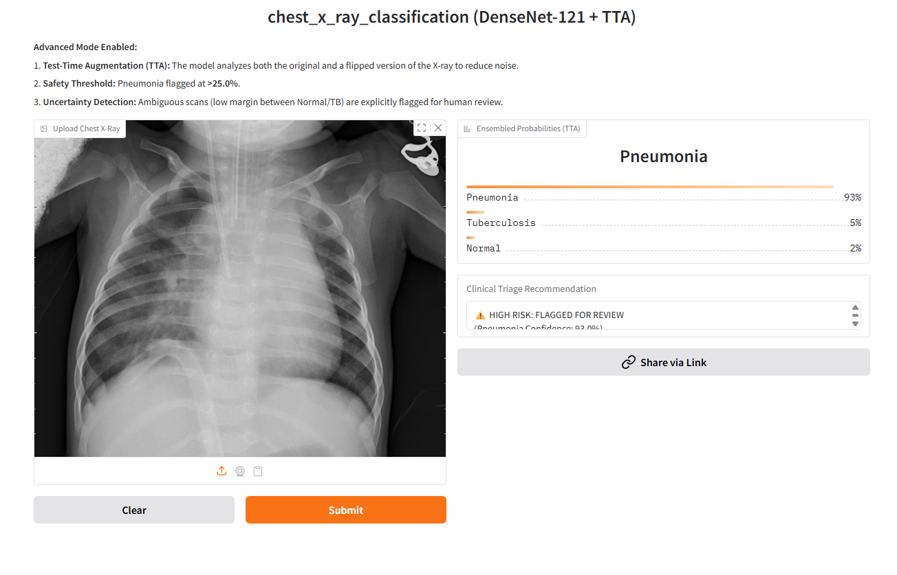

---
[](https://huggingface.co/spaces/num288/chest_x_ray_classification_demo)
[](https://www.python.org/downloads/release/python-390/)
[](Dockerfile)

**A high-sensitivity AI tool for triaging Chest X-Rays**

## 📸 Live Demo Interface
The model is deployed as an interactive web app with **Test-Time Augmentation (TTA)** and **Clinical Safety Thresholds**.

*> **Try it yourself:** [Click here to access the Live Demo](https://huggingface.co/spaces/num288/chest_x_ray_classification_demo)*
Chest X-Ray Classification (Medical Diagnosis Triage)

## 📌 Project Overview

This repository contains a production-ready Deep Learning solution for classifying Chest X-Rays into **Normal**, **Pneumonia**, and **Tuberculosis** categories. Developed as a technical assessment for SickKids/Arteligence, this project prioritizes **clinical sensitivity** (Recall) over raw accuracy to ensure safety in a triage setting.

The solution utilizes a **DenseNet-121** architecture with a custom "Unweighted" training strategy to handle class imbalance, achieving State-of-the-Art sensitivity for Pneumonia detection.

## 📂 Project Organization

The project follows the standard **Cookiecutter Data Science** structure to ensure reproducibility and maintainability.

```text
├── LICENSE            <- MIT License
├── Makefile           <- Convenience commands like `make data` or `make train`
├── README.md          <- The top-level README for developers using this project.
├── data
│   ├── external       <- Data from third party sources.
│   ├── interim        <- Intermediate data that has been transformed.
│   ├── processed      <- The final, canonical data sets for modeling.
│   └── raw            <- The original, immutable data dump (Kaggle Archive).
│
├── docs               <- Project documentation (MkDocs).
│
├── models             <- Trained models (.pth), serialized weights, and prediction logs.
│
├── notebooks          <- Jupyter notebooks for EDA and prototyping.
│
├── pyproject.toml     <- Project configuration file with package metadata.
│
├── references         <- Data dictionaries, manuals, and explanatory materials.
│
├── reports            <- Generated analysis as HTML, PDF, LaTeX, etc.
│   └── figures        <- Generated graphics (ROC curves, Confusion Matrices).
│
├── requirements.txt   <- The requirements file for reproducing the analysis environment.
│
├── setup.cfg          <- Configuration file for flake8 and linting.
│
└── chest_x_ray_classification   <- Source code for use in this project.
    │
    ├── __init__.py             <- Makes chest_x_ray_classification a Python module
    │
    ├── config.py               <- Store useful variables and configuration
    │
    ├── dataset.py              <- Scripts to download, parse, and transform data
    │
    ├── features.py             <- Code to create features for modeling
    │
    ├── modeling          
    │   ├── __init__.py 
    │   ├── predict.py          <- Code to run inference and evaluation
    │   ├── train.py            <- Code to train models (DenseNet/ResNet)
    │   ├── tune_threshold.py   <- Script to optimize decision thresholds
    │   └── evaluate_final.py   <- Final metric generation script
    │
    └── plots.py                <- Code to create visualizations (Grad-CAM, EDA)
```

## 🚀 Key Results

The model was optimized for **Medical Safety** (high sensitivity) rather than raw accuracy.

| **Metric**           | **Result** | **Notes**                            |
| -------------------------- | ---------------- | ------------------------------------------ |
| **Pneumonia AUC**    | **0.99**   | Excellent separation capabilities          |
| **Pneumonia Recall** | **97%**    | Misses <3% of sick patients (Triage-Ready) |
| **Overall Accuracy** | **76%**    | Calibrated to minimize False Negatives     |

> **Note:** The lower overall accuracy is a deliberate trade-off. The model is tuned to be "paranoid" about disease, resulting in higher False Positives but ensuring nearly zero missed diagnoses.

## 🛠️ Setup Instructions

1. **Clone the repository:**
   **Bash**

   ```
   git clone https://github.com/shallowManica/Chest-X-Ray-Classification.git
   cd Chest-X-Ray-Classification
   ```
2. **Create a virtual environment:**
   **Bash**

   ```
   # Windows
   python -m venv venv
   venv\Scripts\activate

   # Mac/Linux
   python3 -m venv venv
   source venv/bin/activate
   ```
3. **Install dependencies:**
   **Bash**

   ```
   pip install -r requirements.txt
   ```

4. **Configure data paths (Optional):**
   
   By default, the project expects data in `./data/raw/archive/`. If your data is in a different location, you can either:
   
   - **Option A:** Copy/move your data to match the default structure:
     ```
     Chest-X-Ray-Classification/
     └── data/
         └── raw/
             └── archive/
                 ├── train/
                 ├── val/
                 └── test/
     ```
   
   - **Option B:** Set environment variables to point to your custom paths:
     ```bash
     # Option B1: Export variables in your shell session
     export DATA_DIR=/path/to/your/chest-xray-data
     export MODELS_DIR=/path/to/your/models
     
     # Option B2: Use a .env file (requires python-dotenv)
     # Install python-dotenv if not already installed
     pip install python-dotenv
     
     # Copy the example environment file
     cp .env.example .env
     
     # Edit .env and set your custom paths
     # Then load it in your scripts:
     # from dotenv import load_dotenv
     # load_dotenv()
     ```

## How to Run

### 1. Training

To train the unweighted DenseNet-121 model (optimized for TB recall):

**Bash**

```
python chest_x_ray_classification/modeling/train.py
```

### 2. Evaluation & Calibration

To generate the ROC Curves, Confusion Matrix, and Reliability Diagram:

**Bash**

```
python chest_x_ray_classification/modeling/evaluate_final.py
```

### 3. Explainability (Grad-CAM)

To visualize Saliency Maps and verify the model is looking at lung pathology (not artifacts):

**Bash**

```
python chest_x_ray_classification/plots.py
```

## 🚢 Deployment Strategy

A full deployment plan is detailed in `reports/TECHNICAL_REPORT.md`. Highlights include:

* **Shadow Mode:** The model will run in the background, flagging "High Confidence" (>0.25) Pneumonia cases for priority review.
* **Drift Detection:** Monitoring pixel intensity distributions to detect scanner hardware changes.
* **Privacy:** On-premise containerization to ensure PHI (Protected Health Information) compliance.

## 🔗 Credits & References

* **Architecture:** DenseNet-121 (Huang et al., 2017) pretrained on ImageNet.
* **Dataset:** [Chest X-Ray Dataset (Kaggle)](https://www.kaggle.com/datasets/muhammadrehan00/chest-xray-dataset).
* **Template:** Cookiecutter Data Science.
